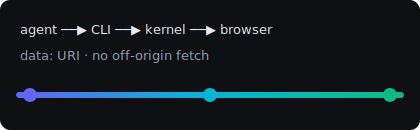

# The InstantCanvas Handbook

> **Death to the admin panel.** The agent gathers the data, reasons about it, and
> delivers the answer *on the fly* — then throws the view away.
>
> — `docs/mission.md`

A paragraph with **bold**, *italic*, ***both***, ~~struck through~~, `inline_code()`,
a literal asterisk \*not emphasis\*, an ampersand & an entity &amp;, and a
[reference link][spec] alongside an <https://example.com/autolink> and an
[inline link](https://example.com "with a title").

---

## 1. Architecture



The renderer resolves that image **server-side** into a `data:` URI. The browser
never issues a request for it, because it cannot: the canvas runs under
`default-src 'none'`.

### 1.1 The request perimeter

1. Bind to the literal `127.0.0.1` — never the wildcard.
2. Check the `Host` header (DNS-rebinding defense).
3. Compare the token with `crypto.timingSafeEqual`.
   1. A nested ordered item.
   2. Another, with a fenced block inside it:

      ```js
      if (!tokenOk(provided)) return forbidden(res, 'bad token')
      ```

4. Serve with `X-Content-Type-Options: nosniff`.

- Unordered, with nesting:
  - second level
    - third level, with `code` and a [link](https://example.com)
      - fourth level, to prove indentation holds

## 2. Tables

Alignment in all three directions, plus a numeric column:

| Kind        | Blocks | Latency (ms) |     Share |
| :---------- | :----: | -----------: | --------: |
| `markdown`  |   1    |         0.42 |    12.5 % |
| `chart`     |   26   |        18.90 |    61.0 % |
| `table`     |   1    |         1.10 |     9.25 % |
| `form`      |   16   |         3.75 |    17.25 % |

A deliberately **wide** table, to prove it scrolls inside its own box rather than
blowing out the measure:

| id | workspace_key | pid | port | token_prefix | started_at | last_activity | ws_clients | pending_sessions | idle_seconds | version |
|---|---|---|---|---|---|---|---|---|---|---|
| 1 | `a3f9c2e1b7d40856` | 48213 | 51877 | `k9Qw…` | 2026-07-10T04:11:02Z | 2026-07-10T05:19:44Z | 2 | 0 | 41 | 0.2.1 |
| 2 | `77bd10ee4c2af993` | 48990 | 52014 | `Zx1p…` | 2026-07-10T04:52:19Z | 2026-07-10T05:20:01Z | 1 | 1 | 3 | 0.2.1 |

## 3. Code, in several languages

```bash
node scripts/instantcanvas.js open report.canvas.json --workspace "$PWD"
```

```python
def inline_images(text: str, root: Path, *, max_bytes: int = 2 << 20) -> str:
    """Rewrite local image refs into data: URIs. Never fetches."""
    for ref in IMAGE_RE.finditer(text):
        if ref["target"].startswith(("http://", "https://")):
            raise RemoteAssetBlocked(ref["target"])  # the agent must resolve it
    return text
```

```rust
fn main() {
    let langs: Vec<&str> = vec!["rust", "sql", "yaml"];
    println!("{} grammars, {:?}", 192, langs);
}
```

```sql
SELECT workspace_key, COUNT(*) AS sessions
FROM   kernels
WHERE  started_at > NOW() - INTERVAL '1 day' AND pending_sessions > 0
GROUP  BY 1 ORDER BY 2 DESC LIMIT 10;
```

```yaml
csp:
  default-src: "'none'"
  img-src: ["'self'", "data:"]
  script-src: "'self'"   # no unsafe-eval, ever
```

```diff
-block.text = fs.readFileSync(abs, 'utf8')
+if (!hasMarkdownExtension(src)) return UNAVAILABLE
+block.text = readMarkdownSrc(ROOT, block.src, MAX_CANVAS_BYTES)
```

A fence with **no language declared** stays plain, rather than being guessed at:

```
$ curl 127.0.0.1:51877/healthz
{"ok":true,"name":"instantcanvas"}
```

An absurdly long line, to prove the code block scrolls instead of wrapping: `const result = await Promise.all(blocks.map(async (block, index) => renderBlock(block, { index, theme, palette, root, token, signal })))`

This fence *documents* HTML, and must **not** trigger the raw-HTML warning:

```html
<table><tr><td>quoted, not rendered</td></tr></table>
```

## 4. Task lists

- [x] Close the `src: ".env"` read hole
- [x] Cap the measure at ~68ch
- [ ] Ship the media block
  - [x] Nested, checked
  - [ ] Nested, unchecked
- [ ] Raise the per-file publish cap

## 5. Raw HTML (warns, then gets dropped)

<table><tr><td>this really is raw HTML</td></tr></table>

## 6. Headings all the way down

#### Heading four
##### Heading five
###### Heading six

Body text after the smallest heading, to check it still outranks nothing.

> Nested quotes:
> > The runtime never reaches off-origin.
> >
> > 1. The agent resolves it.
> > 2. The skill renders it.

[spec]: https://example.com/spec "The originating spec"
